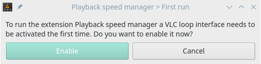
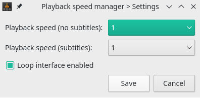

# Playback speed manager

It was initially developed with the purpose to facilitating a user with the listening of a new language by reducing the speed during a dialogue.  
It was later modified to use it as the extension [Time Saver](https://addons.videolan.org/content/show.php?content=169314) (that is no more available on VLC 3.0).

So now this VLC's Addons give the possibility to :

1. Set the speed of the video when there are no subtitles.
2. Set the speed of the video when a subtitle is shown on the screen.

The developed code was obtained starting from the work of the user "mederi" which can be found [here](https://addons.videolan.org/p/1154032/).

# Installation
Put the file `slowsub.lua` in :  

**Windows (all users)**
%ProgramFiles%\VideoLAN\VLC\lua\extensions\

**Windows (current user)**
%APPDATA%\VLC\lua\extensions\

**Linux (all users)**
/usr/lib/vlc/lua/extensions/

**Linux (current user)**
~/.local/share/vlc/lua/extensions/

**Mac OS X (all users)**
/Applications/VLC.app/Contents/MacOS/share/lua/extensions/

**Mac OS X (current user)**
/Users/%your_name%/Library/ApplicationSupport/org.videolan.vlc/lua/extensions/

Put `slowsub_looper_intf.lua` in :  

**Windows (all users)**
%ProgramFiles%\VideoLAN\VLC\lua\intf\

**Windows (current user)**
%APPDATA%\VLC\lua\intf\

**Linux (all users)**
/usr/lib/vlc/lua/intf/

**Linux (current user)**
~/.local/share/vlc/lua/intf/

**Mac OS X (all users)**
/Applications/VLC.app/Contents/MacOS/share/lua/intf/

**Mac OS X (current user)**
/Users/%your_name%/Library/ApplicationSupport/org.videolan.vlc/lua/intf/

At the end, restart VLC.

Note: create the directories if they do not exist.

# How to use
Rename the subtitle file with the name of the video and place it in the same folder.
Open the desired video, go to "view" and select the "slowsub" extension.

In the interface it will be possible to select two values ​​from dropdown menus:

**Playback speed (no subtitles)**
Allows you to select the playback speed when there are no dialogues (no subtitles).

**Playback speed (subtitles)**
Allows you to select the playback speed when subtitle are displayed.

## First use
On first use, the extension will ask to enable the "Loop interface". 
All you have to do is give permission and restart VLC (the procedure is guided). From the following times, this phase will no longer be necessary.  
This procedure is required to enable the script `slowsub_looper_intf.lua`. From this moment the script will be activated in the background at every VLC execution.

## Disable
Every time VLC or the extension is closed the parameters are set to the standard value. If you want to completely disable the extension (in particular the script `slowsub_looper_intf.lua`), you must uncheck the "Loop interface" checkbox, confirm and restart VLC.  
To re-enable the extension it is necessary to follow what is explained in the section "First use".

# Interface
Below is possible to see a preview of the interface.

